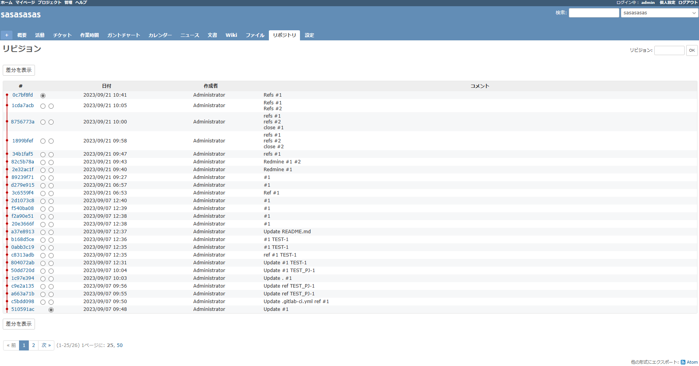
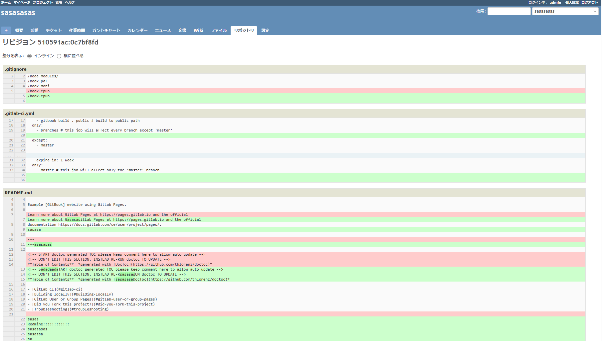
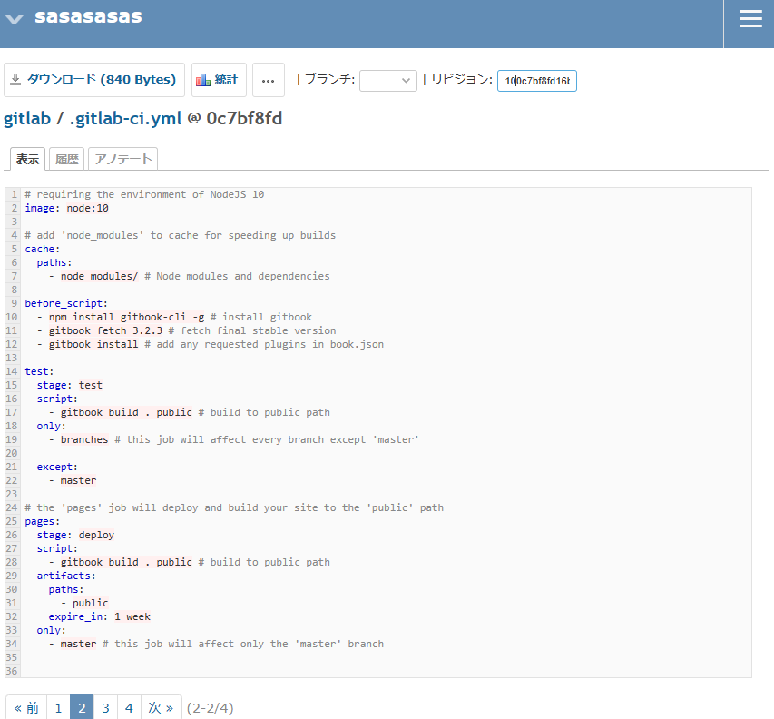
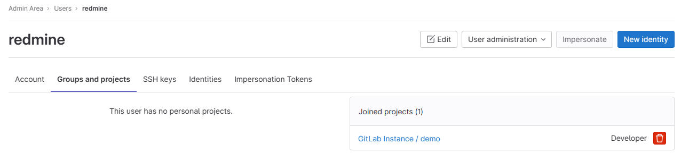

# 要件

- [ ] Redmine 上で、Git リポジトリの差分を確認できる
  - `redmine:4.1.1` ならどのプラグインも動いた
- [x] GitLab 上で、コミットメッセージに記載の ID が Redmine へリンクされる

# 方法

## 0. 初期構築

以下は、構築した Redmine でチケット作成を可能にするための、初期構築手順

### プラグインのインストール

```
cd redmine/plugins/
git clone https://github.com/alphanodes/redmine_messenger.git
```

### 選択肢の値 > チケットの優先度

- 「新しい値」から、適当に「test-priority」というチケットの優先度を作成

### チケットのステータス

- 「新しいステータス」から、適当に「test-status」というステータスを作成

### トラッカー

- 「新しいトラッカー」から、適当に「test-tracker」というトラッカーを作成

### プロジェクト

- 「新しいプロジェクト」から、適当に「test-pj」というプロジェクトを作成

### 管理 > 設定

- `Gitlab` にチェック

### リポジトリ

| バージョン管理システム | 識別子        | リポジトリのパス                                   |
| ---------------------- | ------------- | -------------------------------------------------- |
| Git                    | `local-repo`  | `/usr/src/redmine/repo/demo.git`                   |
| Gitlab                 | `remote-repo` | `https://gitlab/gitlab-instance-41707d42/demo.git` |

### Web Hooks

アクセストークンは Developer でないと使えなかった。
これを git config のリモートリポジトリとして設定しておけば使える。


## 1. GitLab リポジトリの閲覧

基本的に、Redmine のローカルリポジトリが必要になる。
従って、論外だがマウントを共有する方法[^redmine-gitlab-mount]もある。

[^redmine-gitlab-mount]: [Redmine と Gitlab を連携する方法 | 3 月 | 2018 年 | Corporate Blog | 三栄ハイテックス株式会社・LSI 設計や人工知能、組み込みソフト、ビジネス IT 支援](https://www.sanei-hy.co.jp/blog/2018/03/00133/)

Redmine と GitLab を連携するプラグイン[^redmine-gitlab-plugin]があるらしい。
従来は、fetch して、Redmine のローカルリポジトリが必要だったが、これを解消可能になるらしい。
但し、これは自己署名証明書に対応していないので、これが使っているライブラリの作法[^NARKOZ-gitlab-ignore]に則って無効化する必要がある。
しかも、4.19 に対応していないので、自力で変更が必要。
こうすれば、Web Hooks 無しで、勝手に同期してくれる。(ローカルなものがあるかは不明)

```diff:ruby
## Set Gitlab endpoint and token
Gitlab.endpoint = root_url + '/api/v4'
Gitlab.private_token = password
+ Gitlab.httparty = {verify: false}
```

尚、`read_api`のスコープだけ付与でも、動いた。

[^redmine-gitlab-plugin]: [Redmine と GitLab の連携プラグインを開発しました！ | フューチャー技術ブログ](https://future-architect.github.io/articles/20210908a/)
[^NARKOZ-gitlab-ignore]: https://github.com/NARKOZ/gitlab/commit/40295b8889c0094babffc81a5d7749d32b0fbda6

連携に成功すると、以下の様にリポジトリが閲覧可能となる。


更に、個別のファイルを開けば、ダウンロードボタンがある。


いきなりこれは難しそうだが、GitHub[^redmine_github_hook], [^redmine-github-webhooks] なら他にも需要がありそう。
これはきちんと Redmine のプラグインページ[^github-hook]にあった。

[^redmine_github_hook]: https://github.com/koppen/redmine_github_hook
[^redmine-github-webhooks]: [GitHub と Redmine の連携 －Webhooks 編－ - DX 事業 - マクニカ](https://www.macnica.co.jp/business/dx/manufacturers/github/blog_20190109.html)
[^github-hook]: [Github Hook - Plugins - Redmine](https://www.redmine.org/plugins/redmine_github_hook)

GitLab 側の Web Hooks に於いて、Push Evnets でも発火するようにすれば通知してくれる。


尚、`参照用キーワード`で指定したキーワードをコミットメッセージに入れないと、チケットのページにコミットが紐づかない。

## 2. Redmine チケットへの連携

Issues を無効化して、統合の設定をしておけば、リンクが勝手に Redmine になる。
そんなに有用でもない。

## 3. Close 検知による連携

Close 検知で連携する方法[^redmine_github_hook-note]もあるらしい。

[^redmine_github_hook-note]: [GitHub と Redmine を連携させてチケット管理を楽にする方法 | OC テックノート](https://oc-technote.com/github/github-redmine/)

## デバッグ

- リポジトリの権限が、`redmine`で触れない場合

```
["  GithubHook: Executing command: 'git fetch origin 'refs/heads/master:refs/heads/master''","  GithubHook: Command 'git fetch origin 'refs/heads/master:refs/heads/master'' didn't exit properly. Full output: [\"error: cannot open FETCH_HEAD: Permission denied\\n\"]","  GithubHook: Redmine repository updated: git (Git: 2.9ms, Redmine: 1.7ms)"]
```

- リポジトリにアクセスできる権限が無い場合

```
["  GithubHook: Executing command: 'git fetch origin 'refs/heads/master:refs/heads/master''","  GithubHook: Command 'git fetch origin 'refs/heads/master:refs/heads/master'' didn't exit properly. Full output: [\"fatal: could not read Username for 'https://gitlab': No such device or address\\n\"]","  GithubHook: Redmine repository updated: git (Git: 132.1ms, Redmine: 2.1ms)"]
```

# アクセスログ

## GitLab プラグイン

Redmine にてリポジトリタブをクリックすると、以下へのアクセスが確認された。

```
172.18.0.2 - - [21/Sep/2023:10:39:15 +0000] "GET /api/v4/projects/gitlab-instance-41707d42%2Fdemo/repository/branches?page=1&per_page=50 HTTP/1.1" 200 401 "" "Gitlab Ruby Gem 4.19.0" 2.06
172.18.0.2 - - [21/Sep/2023:10:39:15 +0000] "GET /api/v4/projects/gitlab-instance-41707d42%2Fdemo/repository/branches?page=2&per_page=50 HTTP/1.1" 200 2 "" "Gitlab Ruby Gem 4.19.0" -
172.18.0.2 - - [21/Sep/2023:10:39:16 +0000] "GET /api/v4/projects/gitlab-instance-41707d42%2Fdemo/repository/commits?all=true&since=2023-09-21T10%3A05%3A31Z&page=1&per_page=50 HTTP/1.1" 200 323 "" "Gitlab Ruby Gem 4.19.0" 1.86
172.18.0.2 - - [21/Sep/2023:10:39:16 +0000] "GET /api/v4/projects/gitlab-instance-41707d42%2Fdemo/repository/commits?all=true&since=2023-09-21T10%3A05%3A31Z&page=1&per_page=50 HTTP/1.1" 200 323 "" "Gitlab Ruby Gem 4.19.0" 1.86
172.18.0.2 - - [21/Sep/2023:10:39:16 +0000] "GET /api/v4/projects/gitlab-instance-41707d42%2Fdemo/repository/commits/1cda7acbb2f9f6045d671f03c26e52ff6a7b29a1/diff HTTP/1.1" 200 268 "" "Gitlab Ruby Gem 4.19.0" 1.46
172.18.0.2 - - [21/Sep/2023:10:39:16 +0000] "GET /api/v4/projects/gitlab-instance-41707d42%2Fdemo/repository/commits?all=true&since=2023-09-21T10%3A05%3A31Z&page=2&per_page=50 HTTP/1.1" 200 2 "" "Gitlab Ruby Gem 4.19.0" -
172.18.0.2 - - [21/Sep/2023:10:39:16 +0000] "GET /api/v4/projects/gitlab-instance-41707d42%2Fdemo/repository/tree?path=&ref=master&page=1&per_page=50 HTTP/1.1" 200 258 "" "Gitlab Ruby Gem 4.19.0" 1.97
172.18.0.2 - - [21/Sep/2023:10:39:16 +0000] "GET /api/v4/projects/gitlab-instance-41707d42%2Fdemo/repository/files/.gitignore?ref=master HTTP/1.1" 200 345 "" "Gitlab Ruby Gem 4.19.0" 1.39
172.18.0.2 - - [21/Sep/2023:10:39:16 +0000] "GET /api/v4/projects/gitlab-instance-41707d42%2Fdemo/repository/commits?path=.gitignore&ref_name=master&per_page=1 HTTP/1.1" 200 332 "" "Gitlab Ruby Gem 4.19.0" 1.87
172.18.0.2 - - [21/Sep/2023:10:39:16 +0000] "GET /api/v4/projects/gitlab-instance-41707d42%2Fdemo/repository/files/.gitlab-ci.yml?ref=master HTTP/1.1" 200 947 "" "Gitlab Ruby Gem 4.19.0" 1.62
172.18.0.2 - - [21/Sep/2023:10:39:17 +0000] "GET /api/v4/projects/gitlab-instance-41707d42%2Fdemo/repository/commits?path=.gitlab-ci.yml&ref_name=master&per_page=1 HTTP/1.1" 200 332 "" "Gitlab Ruby Gem 4.19.0" 1.86
172.18.0.2 - - [21/Sep/2023:10:39:17 +0000] "GET /api/v4/projects/gitlab-instance-41707d42%2Fdemo/repository/files/README.md?ref=master HTTP/1.1" 200 2801 "" "Gitlab Ruby Gem 4.19.0" 1.86
172.18.0.2 - - [21/Sep/2023:10:39:17 +0000] "GET /api/v4/projects/gitlab-instance-41707d42%2Fdemo/repository/commits?path=README.md&ref_name=master&per_page=1 HTTP/1.1" 200 323 "" "Gitlab Ruby Gem 4.19.0" 1.86
172.18.0.2 - - [21/Sep/2023:10:39:17 +0000] "GET /api/v4/projects/gitlab-instance-41707d42%2Fdemo/repository/files/SUMMARY.md?ref=master HTTP/1.1" 200 378 "" "Gitlab Ruby Gem 4.19.0" 1.36
172.18.0.2 - - [21/Sep/2023:10:39:17 +0000] "GET /api/v4/projects/gitlab-instance-41707d42%2Fdemo/repository/commits?path=SUMMARY.md&ref_name=master&per_page=1 HTTP/1.1" 200 326 "" "Gitlab Ruby Gem 4.19.0" 1.88
172.18.0.2 - - [21/Sep/2023:10:39:17 +0000] "GET /api/v4/projects/gitlab-instance-41707d42%2Fdemo/repository/tree?path=&ref=master&page=2&per_page=50 HTTP/1.1" 200 2 "" "Gitlab Ruby Gem 4.19.0" -
172.18.0.2 - - [21/Sep/2023:10:39:17 +0000] "GET /api/v4/projects/gitlab-instance-41707d42%2Fdemo/repository/commits?path=&ref_name=master&per_page=10 HTTP/1.1" 200 942 "" "Gitlab Ruby Gem 4.19.0" 6.17
172.18.0.2 - - [21/Sep/2023:10:39:17 +0000] "GET /api/v4/projects/gitlab-instance-41707d42%2Fdemo/repository/tags?page=1&per_page=50 HTTP/1.1" 200 2 "" "Gitlab Ruby Gem 4.19.0" -
172.18.0.2 - - [21/Sep/2023:10:39:17 +0000] "GET /api/v4/projects/gitlab-instance-41707d42%2Fdemo/repository/branches?page=1&per_page=50 HTTP/1.1" 200 401 "" "Gitlab Ruby Gem 4.19.0" 2.06
172.18.0.2 - - [21/Sep/2023:10:39:17 +0000] "GET /api/v4/projects/gitlab-instance-41707d42%2Fdemo/repository/branches?page=2&per_page=50 HTTP/1.1" 200 2 "" "Gitlab Ruby Gem 4.19.0" -
172.18.0.2 - - [21/Sep/2023:10:39:17 +0000] "GET /api/v4/projects/gitlab-instance-41707d42%2Fdemo/repository/commits?all=true&since=2023-09-21T10%3A05%3A31Z&page=1&per_page=50 HTTP/1.1" 200 323 "" "Gitlab Ruby Gem 4.19.0" 1.86
172.18.0.2 - - [21/Sep/2023:10:39:17 +0000] "GET /api/v4/projects/gitlab-instance-41707d42%2Fdemo/repository/commits?all=true&since=2023-09-21T10%3A05%3A31Z&page=1&per_page=50 HTTP/1.1" 200 323 "" "Gitlab Ruby Gem 4.19.0" 1.86
172.18.0.2 - - [21/Sep/2023:10:39:17 +0000] "GET /api/v4/projects/gitlab-instance-41707d42%2Fdemo/repository/commits/1cda7acbb2f9f6045d671f03c26e52ff6a7b29a1/diff HTTP/1.1" 200 268 "" "Gitlab Ruby Gem 4.19.0" 1.46
172.18.0.2 - - [21/Sep/2023:10:39:17 +0000] "GET /api/v4/projects/gitlab-instance-41707d42%2Fdemo/repository/commits?all=true&since=2023-09-21T10%3A05%3A31Z&page=2&per_page=50 HTTP/1.1" 200 2 "" "Gitlab Ruby Gem 4.19.0" -
172.18.0.2 - - [21/Sep/2023:10:39:17 +0000] "GET /api/v4/projects/gitlab-instance-41707d42%2Fdemo/repository/tree?path=&ref=master&page=1&per_page=50 HTTP/1.1" 200 258 "" "Gitlab Ruby Gem 4.19.0" 1.97
172.18.0.2 - - [21/Sep/2023:10:39:17 +0000] "GET /api/v4/projects/gitlab-instance-41707d42%2Fdemo/repository/files/.gitignore?ref=master HTTP/1.1" 200 345 "" "Gitlab Ruby Gem 4.19.0" 1.39
172.18.0.2 - - [21/Sep/2023:10:39:18 +0000] "GET /api/v4/projects/gitlab-instance-41707d42%2Fdemo/repository/commits?path=.gitignore&ref_name=master&per_page=1 HTTP/1.1" 200 332 "" "Gitlab Ruby Gem 4.19.0" 1.87
172.18.0.2 - - [21/Sep/2023:10:39:18 +0000] "GET /api/v4/projects/gitlab-instance-41707d42%2Fdemo/repository/files/.gitlab-ci.yml?ref=master HTTP/1.1" 200 947 "" "Gitlab Ruby Gem 4.19.0" 1.62
172.18.0.2 - - [21/Sep/2023:10:39:18 +0000] "GET /api/v4/projects/gitlab-instance-41707d42%2Fdemo/repository/commits?path=.gitlab-ci.yml&ref_name=master&per_page=1 HTTP/1.1" 200 332 "" "Gitlab Ruby Gem 4.19.0" 1.86
172.18.0.2 - - [21/Sep/2023:10:39:18 +0000] "GET /api/v4/projects/gitlab-instance-41707d42%2Fdemo/repository/files/README.md?ref=master HTTP/1.1" 200 2801 "" "Gitlab Ruby Gem 4.19.0" 1.86
172.18.0.2 - - [21/Sep/2023:10:39:18 +0000] "GET /api/v4/projects/gitlab-instance-41707d42%2Fdemo/repository/commits?path=README.md&ref_name=master&per_page=1 HTTP/1.1" 200 323 "" "Gitlab Ruby Gem 4.19.0" 1.86
172.18.0.2 - - [21/Sep/2023:10:39:18 +0000] "GET /api/v4/projects/gitlab-instance-41707d42%2Fdemo/repository/files/SUMMARY.md?ref=master HTTP/1.1" 200 378 "" "Gitlab Ruby Gem 4.19.0" 1.36
172.18.0.2 - - [21/Sep/2023:10:39:18 +0000] "GET /api/v4/projects/gitlab-instance-41707d42%2Fdemo/repository/commits?path=SUMMARY.md&ref_name=master&per_page=1 HTTP/1.1" 200 326 "" "Gitlab Ruby Gem 4.19.0" 1.88
172.18.0.2 - - [21/Sep/2023:10:39:18 +0000] "GET /api/v4/projects/gitlab-instance-41707d42%2Fdemo/repository/tree?path=&ref=master&page=2&per_page=50 HTTP/1.1" 200 2 "" "Gitlab Ruby Gem 4.19.0" -
172.18.0.2 - - [21/Sep/2023:10:39:18 +0000] "GET /api/v4/projects/gitlab-instance-41707d42%2Fdemo/repository/commits?path=&ref_name=master&per_page=10 HTTP/1.1" 200 942 "" "Gitlab Ruby Gem 4.19.0" 6.17
172.18.0.2 - - [21/Sep/2023:10:39:18 +0000] "GET /api/v4/projects/gitlab-instance-41707d42%2Fdemo/repository/tags?page=1&per_page=50 HTTP/1.1" 200 2 "" "Gitlab Ruby Gem 4.19.0" -
127.0.0.1 - - [21/Sep/2023:10:39:20 +0000] "GET /help HTTP/1.1" 200 71357 "" "curl/7.87.0-DEV" -
```

また、ユーザー名も残る詳細なアクセスログは以下
```
==> /var/log/gitlab/gitlab-rails/production.log <==
Started GET "/api/v4/projects/gitlab-instance-41707d42%2Fdemo/repository/tags?page=1&per_page=50" for 172.18.0.2 at 2023-11-28 09:38:33 +0000

==> /var/log/gitlab/gitlab-rails/api_json.log <==
{"time":"2023-11-28T09:38:33.401Z","severity":"INFO","duration_s":0.04199,"db_duration_s":0.00523,"view_duration_s":0.03676,"status":200,"method":"GET","path":"/api/v4/projects/gitlab-instance-41707d42%2Fdemo/repository/tags","params":[{"key":"page","value":"1"},{"key":"per_page","value":"50"}],"host":"gitlab","remote_ip":"172.18.0.2, 127.0.0.1","ua":"Gitlab Ruby Gem 4.19.0","route":"/api/:version/projects/:id/repository/tags","user_id":43,"username":"project_34_bot3","token_type":"PersonalAccessToken","token_id":13,"queue_duration_s":0.011633,"gitaly_calls":1,"gitaly_duration_s":0.004198,"redis_calls":3,"redis_duration_s":0.0007909999999999999,"redis_read_bytes":214,"redis_write_bytes":168,"redis_cache_calls":2,"redis_cache_duration_s":0.000542,"redis_cache_read_bytes":214,"redis_cache_write_bytes":114,"redis_shared_state_calls":1,"redis_shared_state_duration_s":0.000249,"redis_shared_state_write_bytes":54,"db_count":10,"db_write_count":0,"db_cached_count":1,"db_replica_count":0,"db_primary_count":10,"db_main_count":10,"db_main_replica_count":0,"db_replica_cached_count":0,"db_primary_cached_count":1,"db_main_cached_count":1,"db_main_replica_cached_count":0,"db_replica_wal_count":0,"db_primary_wal_count":0,"db_main_wal_count":0,"db_main_replica_wal_count":0,"db_replica_wal_cached_count":0,"db_primary_wal_cached_count":0,"db_main_wal_cached_count":0,"db_main_replica_wal_cached_count":0,"db_replica_duration_s":0.0,"db_primary_duration_s":0.006,"db_main_duration_s":0.006,"db_main_replica_duration_s":0.0,"cpu_s":0.048825,"mem_objects":21855,"mem_bytes":1564008,"mem_mallocs":4907,"mem_total_bytes":2438208,"pid":744,"worker_id":"puma_6","rate_limiting_gates":[],"correlation_id":"01HGAMPTQX5TT98W2S6FACJEZM","meta.caller_id":"GET /api/:version/projects/:id/repository/tags","meta.remote_ip":"172.18.0.2","meta.feature_category":"source_code_management","meta.user":"project_34_bot3","meta.user_id":43,"meta.project":"gitlab-instance-41707d42/demo","meta.root_namespace":"gitlab-instance-41707d42","meta.client_id":"user/43","request_urgency":"low","target_duration_s":5}
```

確認すると以下
```
root@localhost:/# gitlab-rails c
--------------------------------------------------------------------------------
 Ruby:         ruby 2.7.7p221 (2022-11-24 revision 168ec2b1e5) [x86_64-linux]
 GitLab:       15.8.1-ee (c49deff6e37) EE
 GitLab Shell: 14.15.0
 PostgreSQL:   13.8
------------------------------------------------------------[ booted in 21.05s ]
userLoading production environment (Rails 6.1.6.1)
irb(main):001:0> user = User.find_by(id: 43)
=> #<User id:43 @project_34_bot3>
irb(main):002:0> user.name
=> "redmine"
```

このアカウントは、管理者メニューから、どのプロジェクトで使われているか等の詳細を確認可能。


## GitHub プラグイン

GitLab にて master ブランチで更新を掛けると、以下へのアクセスが確認された。(Web IDE によるものも含む)

```
172.18.0.1 - - [21/Sep/2023:10:41:31 +0000] "GET /gitlab-instance-41707d42/demo/commit/1cda7acbb2f9f6045d671f03c26e52ff6a7b29a1/pipelines HTTP/2.0" 301 173 "https://localhost/-/ide/project/gitlab-instance-41707d42/demo/tree/master/-/" "Mozilla/5.0 (Windows NT 10.0; Win64; x64) AppleWebKit/537.36 (KHTML, like Gecko) Chrome/117.0.0.0 Safari/537.36 Edg/117.0.2045.31" -
172.18.0.1 - - [21/Sep/2023:10:41:31 +0000] "GET /gitlab-instance-41707d42/demo/-/commit/1cda7acbb2f9f6045d671f03c26e52ff6a7b29a1/pipelines HTTP/2.0" 200 1086 "https://localhost/-/ide/project/gitlab-instance-41707d42/demo/tree/master/-/" "Mozilla/5.0 (Windows NT 10.0; Win64; x64) AppleWebKit/537.36 (KHTML, like Gecko) Chrome/117.0.0.0 Safari/537.36 Edg/117.0.2045.31" 3.17
172.18.0.1 - - [21/Sep/2023:10:41:31 +0000] "POST /api/v4/projects/gitlab-instance-41707d42%2Fdemo/repository/commits HTTP/2.0" 201 668 "https://localhost/-/ide/project/gitlab-instance-41707d42/demo/tree/master/-/" "Mozilla/5.0 (Windows NT 10.0; Win64; x64) AppleWebKit/537.36 (KHTML, like Gecko) Chrome/117.0.0.0 Safari/537.36 Edg/117.0.2045.31" -
172.18.0.1 - - [21/Sep/2023:10:41:31 +0000] "POST /gitlab-instance-41707d42/demo/ide_terminals/check_config HTTP/2.0" 422 0 "https://localhost/-/ide/project/gitlab-instance-41707d42/demo/tree/master/-/" "Mozilla/5.0 (Windows NT 10.0; Win64; x64) AppleWebKit/537.36 (KHTML, like Gecko) Chrome/117.0.0.0 Safari/537.36 Edg/117.0.2045.31" -
172.18.0.1 - - [21/Sep/2023:10:41:31 +0000] "GET /assets/webpack/yaml.fe43b05f.worker.js HTTP/2.0" 200 351681 "https://localhost/-/ide/project/gitlab-instance-41707d42/demo/tree/master/-/README.md/" "Mozilla/5.0 (Windows NT 10.0; Win64; x64) AppleWebKit/537.36 (KHTML, like Gecko) Chrome/117.0.0.0 Safari/537.36 Edg/117.0.2045.31" -
172.18.0.1 - - [21/Sep/2023:10:41:31 +0000] "GET /assets/webpack/editor.84a8ae44.worker.js HTTP/2.0" 200 44179 "https://localhost/-/ide/project/gitlab-instance-41707d42/demo/tree/master/-/README.md/" "Mozilla/5.0 (Windows NT 10.0; Win64; x64) AppleWebKit/537.36 (KHTML, like Gecko) Chrome/117.0.0.0 Safari/537.36 Edg/117.0.2045.31" -
172.18.0.1 - - [21/Sep/2023:10:41:31 +0000] "GET /api/v4/projects/34/runners?scope=active HTTP/2.0" 200 2 "https://localhost/-/ide/project/gitlab-instance-41707d42/demo/tree/master/-/" "Mozilla/5.0 (Windows NT 10.0; Win64; x64) AppleWebKit/537.36 (KHTML, like Gecko) Chrome/117.0.0.0 Safari/537.36 Edg/117.0.2045.31" -
172.18.0.1 - - [21/Sep/2023:10:41:31 +0000] "GET /api/v4/projects/gitlab-instance-41707d42%2Fdemo/repository/branches/master HTTP/2.0" 200 381 "https://localhost/-/ide/project/gitlab-instance-41707d42/demo/tree/master/-/README.md/" "Mozilla/5.0 (Windows NT 10.0; Win64; x64) AppleWebKit/537.36 (KHTML, like Gecko) Chrome/117.0.0.0 Safari/537.36 Edg/117.0.2045.31" 2.07
172.18.0.2 - - [21/Sep/2023:10:41:32 +0000] "GET /api/v4/projects/gitlab-instance-41707d42%2Fdemo/repository/branches?page=1&per_page=50 HTTP/1.1" 200 393 "" "Gitlab Ruby Gem 4.19.0" 2.08
172.18.0.2 - - [21/Sep/2023:10:41:32 +0000] "GET /gitlab-instance-41707d42/demo.git/info/refs?service=git-upload-pack HTTP/2.0" 401 265 "" "git/2.20.1" -
172.18.0.2 - redmine [21/Sep/2023:10:41:32 +0000] "GET /gitlab-instance-41707d42/demo.git/info/refs?service=git-upload-pack HTTP/2.0" 200 295 "" "git/2.20.1" -
172.18.0.2 - - [21/Sep/2023:10:41:32 +0000] "GET /api/v4/projects/gitlab-instance-41707d42%2Fdemo/repository/branches?page=2&per_page=50 HTTP/1.1" 200 2 "" "Gitlab Ruby Gem 4.19.0" -
172.18.0.2 - redmine [21/Sep/2023:10:41:32 +0000] "POST /gitlab-instance-41707d42/demo.git/git-upload-pack HTTP/2.0" 200 1315 "" "git/2.20.1" -
172.18.0.2 - - [21/Sep/2023:10:41:32 +0000] "GET /api/v4/projects/gitlab-instance-41707d42%2Fdemo/repository/commits?all=true&since=2023-09-21T10%3A05%3A31Z&page=1&per_page=50 HTTP/1.1" 200 385 "" "Gitlab Ruby Gem 4.19.0" 3.08
172.18.0.2 - - [21/Sep/2023:10:41:32 +0000] "GET /api/v4/projects/gitlab-instance-41707d42%2Fdemo/repository/commits?all=true&since=2023-09-21T10%3A05%3A31Z&page=1&per_page=50 HTTP/1.1" 200 385 "" "Gitlab Ruby Gem 4.19.0" 3.08
172.18.0.2 - - [21/Sep/2023:10:41:32 +0000] "GET /gitlab-instance-41707d42/demo.git/info/refs?service=git-upload-pack HTTP/2.0" 401 265 "" "git/2.20.1" -
172.18.0.2 - - [21/Sep/2023:10:41:32 +0000] "GET /api/v4/projects/gitlab-instance-41707d42%2Fdemo/repository/commits/1cda7acbb2f9f6045d671f03c26e52ff6a7b29a1/diff HTTP/1.1" 200 268 "" "Gitlab Ruby Gem 4.19.0" 1.46
172.18.0.2 - redmine [21/Sep/2023:10:41:32 +0000] "GET /gitlab-instance-41707d42/demo.git/info/refs?service=git-upload-pack HTTP/2.0" 200 295 "" "git/2.20.1" -
172.18.0.2 - - [21/Sep/2023:10:41:32 +0000] "GET /api/v4/projects/gitlab-instance-41707d42%2Fdemo/repository/commits/0c7bf8fd16b615b3e217a83ff44dde35e6a2f63a/diff HTTP/1.1" 200 251 "" "Gitlab Ruby Gem 4.19.0" 1.45
172.18.0.2 - - [21/Sep/2023:10:41:32 +0000] "GET /api/v4/projects/gitlab-instance-41707d42%2Fdemo/repository/commits?all=true&since=2023-09-21T10%3A05%3A31Z&page=2&per_page=50 HTTP/1.1" 200 2 "" "Gitlab Ruby Gem 4.19.0" -
```

## Redmine

Redmine 側では、リポジトリを閲覧した人がアクセスログとして残る

```
redmine-gitlab-redmine-1  | I, [2023-10-27T05:57:00.519858 #1]  INFO -- :   Rendered common/_tabs.html.erb (40.0ms)
redmine-gitlab-redmine-1  | I, [2023-10-27T05:57:00.519919 #1]  INFO -- :   Rendered settings/edit.html.erb within layouts/admin (40.2ms)
redmine-gitlab-redmine-1  | I, [2023-10-27T05:57:00.520926 #1]  INFO -- :   Rendered admin/_menu.html.erb (0.9ms)
redmine-gitlab-redmine-1  | I, [2023-10-27T05:57:00.521004 #1]  INFO -- :   Rendering layouts/base.html.erb
redmine-gitlab-redmine-1  | I, [2023-10-27T05:57:00.524098 #1]  INFO -- :   Rendered layouts/base.html.erb (3.1ms)
redmine-gitlab-redmine-1  | I, [2023-10-27T05:57:00.524277 #1]  INFO -- : Completed 200 OK in 54ms (Views: 41.2ms | ActiveRecord: 10.1ms)
redmine-gitlab-redmine-1  | I, [2023-10-27T05:57:31.716871 #1]  INFO -- : Started GET "/projects/demo?jump=settings" for 172.18.0.1 at 2023-10-27 05:57:31 +0000
redmine-gitlab-redmine-1  | I, [2023-10-27T05:57:31.717582 #1]  INFO -- : Processing by ProjectsController#show as HTML
redmine-gitlab-redmine-1  | I, [2023-10-27T05:57:31.717619 #1]  INFO -- :   Parameters: {"jump"=>"settings", "id"=>"demo"}
redmine-gitlab-redmine-1  | I, [2023-10-27T05:57:31.726150 #1]  INFO -- :   Current user: admin (id=1)
redmine-gitlab-redmine-1  | I, [2023-10-27T05:57:31.727506 #1]  INFO -- : Redirected to http://localhost:3000/projects/demo/settings
redmine-gitlab-redmine-1  | I, [2023-10-27T05:57:31.728081 #1]  INFO -- : Completed 302 Found in 10ms (ActiveRecord: 6.7ms)
redmine-gitlab-redmine-1  | I, [2023-10-27T05:57:31.732960 #1]  INFO -- : Started GET "/projects/demo/settings" for 172.18.0.1 at 2023-10-27 05:57:31 +0000
redmine-gitlab-redmine-1  | I, [2023-10-27T05:57:31.733362 #1]  INFO -- : Processing by ProjectsController#settings as HTML
redmine-gitlab-redmine-1  | I, [2023-10-27T05:57:31.733377 #1]  INFO -- :   Parameters: {"id"=>"demo"}
redmine-gitlab-redmine-1  | I, [2023-10-27T05:57:31.740947 #1]  INFO -- :   Current user: admin (id=1)
redmine-gitlab-redmine-1  | I, [2023-10-27T05:57:31.743512 #1]  INFO -- :   Rendering projects/settings.html.erb within layouts/base
redmine-gitlab-redmine-1  | I, [2023-10-27T05:57:31.747609 #1]  INFO -- :   Rendered projects/_form.html.erb (2.6ms)
redmine-gitlab-redmine-1  | I, [2023-10-27T05:57:31.747774 #1]  INFO -- :   Rendered projects/_edit.html.erb (3.0ms)
redmine-gitlab-redmine-1  | I, [2023-10-27T05:57:31.748938 #1]  INFO -- :   Rendered projects/settings/_members.html.erb (1.1ms)
redmine-gitlab-redmine-1  | I, [2023-10-27T05:57:31.751493 #1]  INFO -- :   Rendered projects/settings/_issues.html.erb (2.5ms)
redmine-gitlab-redmine-1  | I, [2023-10-27T05:57:31.752512 #1]  INFO -- :   Rendered projects/settings/_versions.html.erb (0.9ms)
redmine-gitlab-redmine-1  | I, [2023-10-27T05:57:31.753043 #1]  INFO -- :   Rendered projects/settings/_issue_categories.html.erb (0.5ms)
redmine-gitlab-redmine-1  | I, [2023-10-27T05:57:31.754010 #1]  INFO -- :   Rendered projects/settings/_repositories.html.erb (0.9ms)
redmine-gitlab-redmine-1  | I, [2023-10-27T05:57:31.754478 #1]  INFO -- :   Rendered projects/settings/_boards.html.erb (0.4ms)
redmine-gitlab-redmine-1  | I, [2023-10-27T05:57:31.755872 #1]  INFO -- :   Rendered projects/settings/_activities.html.erb (1.3ms)
redmine-gitlab-redmine-1  | I, [2023-10-27T05:57:31.755913 #1]  INFO -- :   Rendered common/_tabs.html.erb (11.8ms)
redmine-gitlab-redmine-1  | I, [2023-10-27T05:57:31.755970 #1]  INFO -- :   Rendered projects/settings.html.erb within layouts/base (12.4ms)
redmine-gitlab-redmine-1  | I, [2023-10-27T05:57:31.764026 #1]  INFO -- : Completed 200 OK in 31ms (Views: 18.9ms | ActiveRecord: 7.9ms)
redmine-gitlab-redmine-1  | I, [2023-10-27T05:57:34.976226 #1]  INFO -- : Started GET "/projects/demo/repository/gitlab" for 172.18.0.1 at 2023-10-27 05:57:34 +0000
redmine-gitlab-redmine-1  | I, [2023-10-27T05:57:34.976824 #1]  INFO -- : Processing by RepositoriesController#show as HTML
redmine-gitlab-redmine-1  | I, [2023-10-27T05:57:34.976855 #1]  INFO -- :   Parameters: {"id"=>"demo", "repository_id"=>"gitlab"}
redmine-gitlab-redmine-1  | I, [2023-10-27T05:57:35.004343 #1]  INFO -- :   Current user: admin (id=1)
redmine-gitlab-redmine-1  | I, [2023-10-27T05:57:35.055167 #1]  INFO -- :   Rendering common/error.html.erb within layouts/base
redmine-gitlab-redmine-1  | I, [2023-10-27T05:57:35.055294 #1]  INFO -- :   Rendered common/error.html.erb within layouts/base (0.1ms)
redmine-gitlab-redmine-1  | I, [2023-10-27T05:57:35.063237 #1]  INFO -- : Completed 404 Not Found in 86ms (Views: 7.7ms | ActiveRecord: 26.6ms)
redmine-gitlab-redmine-1  | I, [2023-10-27T05:59:04.697600 #1]  INFO -- : Started GET "/repositories/1/edit" for 172.18.0.1 at 2023-10-27 05:59:04 +0000
redmine-gitlab-redmine-1  | I, [2023-10-27T05:59:04.698134 #1]  INFO -- : Processing by RepositoriesController#edit as HTML
redmine-gitlab-redmine-1  | I, [2023-10-27T05:59:04.698156 #1]  INFO -- :   Parameters: {"id"=>"1"}
redmine-gitlab-redmine-1  | I, [2023-10-27T05:59:04.707576 #1]  INFO -- :   Current user: admin (id=1)
redmine-gitlab-redmine-1  | I, [2023-10-27T05:59:04.709076 #1]  INFO -- :   Rendering repositories/edit.html.erb within layouts/base
redmine-gitlab-redmine-1  | I, [2023-10-27T05:59:04.710693 #1]  INFO -- :   Rendered repositories/_form.html.erb (1.4ms)
redmine-gitlab-redmine-1  | I, [2023-10-27T05:59:04.710847 #1]  INFO -- :   Rendered repositories/edit.html.erb within layouts/base (1.7ms)
redmine-gitlab-redmine-1  | I, [2023-10-27T05:59:04.717999 #1]  INFO -- : Completed 200 OK in 20ms (Views: 8.5ms | ActiveRecord: 8.4ms)
redmine-gitlab-redmine-1  | I, [2023-10-27T05:59:07.267112 #1]  INFO -- : Started PUT "/repositories/1" for 172.18.0.1 at 2023-10-27 05:59:07 +0000
redmine-gitlab-redmine-1  | I, [2023-10-27T05:59:07.267616 #1]  INFO -- : Processing by RepositoriesController#update as HTML
redmine-gitlab-redmine-1  | I, [2023-10-27T05:59:07.267640 #1]  INFO -- :   Parameters: {"utf8"=>"✓", "authenticity_token"=>"aJ1EyOY1R+kNJuSEok//mMkRErVH0um66DhgWPxvkz9ZDZiowsZEQ8fAkf8nbaz8JS6ejzcWG4lkef21hq3ZFQ==", "repository"=>{"is_default"=>"1", "password"=>"[FILTERED]", "root_url"=>"https://gitlab", "report_last_commit"=>"0"}, "commit"=>"保存", "id"=>"1"}
redmine-gitlab-redmine-1  | I, [2023-10-27T05:59:07.285632 #1]  INFO -- :   Current user: admin (id=1)
redmine-gitlab-redmine-1  | I, [2023-10-27T05:59:07.297346 #1]  INFO -- : Redirected to http://localhost:3000/projects/demo/settings/repositories
redmine-gitlab-redmine-1  | I, [2023-10-27T05:59:07.298154 #1]  INFO -- : Completed 302 Found in 30ms (ActiveRecord: 25.4ms)
redmine-gitlab-redmine-1  | I, [2023-10-27T05:59:07.304159 #1]  INFO -- : Started GET "/projects/demo/settings/repositories" for 172.18.0.1 at 2023-10-27 05:59:07 +0000
redmine-gitlab-redmine-1  | I, [2023-10-27T05:59:07.304583 #1]  INFO -- : Processing by ProjectsController#settings as HTML
redmine-gitlab-redmine-1  | I, [2023-10-27T05:59:07.304599 #1]  INFO -- :   Parameters: {"id"=>"demo", "tab"=>"repositories"}
redmine-gitlab-redmine-1  | I, [2023-10-27T05:59:07.312514 #1]  INFO -- :   Current user: admin (id=1)
redmine-gitlab-redmine-1  | I, [2023-10-27T05:59:07.315022 #1]  INFO -- :   Rendering projects/settings.html.erb within layouts/base
redmine-gitlab-redmine-1  | I, [2023-10-27T05:59:07.319499 #1]  INFO -- :   Rendered projects/_form.html.erb (2.7ms)
redmine-gitlab-redmine-1  | I, [2023-10-27T05:59:07.319667 #1]  INFO -- :   Rendered projects/_edit.html.erb (3.0ms)
redmine-gitlab-redmine-1  | I, [2023-10-27T05:59:07.320795 #1]  INFO -- :   Rendered projects/settings/_members.html.erb (1.1ms)
redmine-gitlab-redmine-1  | I, [2023-10-27T05:59:07.322927 #1]  INFO -- :   Rendered projects/settings/_issues.html.erb (2.1ms)
redmine-gitlab-redmine-1  | I, [2023-10-27T05:59:07.323879 #1]  INFO -- :   Rendered projects/settings/_versions.html.erb (0.9ms)
redmine-gitlab-redmine-1  | I, [2023-10-27T05:59:07.324365 #1]  INFO -- :   Rendered projects/settings/_issue_categories.html.erb (0.4ms)
redmine-gitlab-redmine-1  | I, [2023-10-27T05:59:07.325241 #1]  INFO -- :   Rendered projects/settings/_repositories.html.erb (0.8ms)
redmine-gitlab-redmine-1  | I, [2023-10-27T05:59:07.325679 #1]  INFO -- :   Rendered projects/settings/_boards.html.erb (0.4ms)
redmine-gitlab-redmine-1  | I, [2023-10-27T05:59:07.326981 #1]  INFO -- :   Rendered projects/settings/_activities.html.erb (1.2ms)
redmine-gitlab-redmine-1  | I, [2023-10-27T05:59:07.327021 #1]  INFO -- :   Rendered common/_tabs.html.erb (11.2ms)
redmine-gitlab-redmine-1  | I, [2023-10-27T05:59:07.327060 #1]  INFO -- :   Rendered projects/settings.html.erb within layouts/base (12.0ms)
redmine-gitlab-redmine-1  | I, [2023-10-27T05:59:07.334839 #1]  INFO -- : Completed 200 OK in 30ms (Views: 18.3ms | ActiveRecord: 8.6ms)
redmine-gitlab-redmine-1  | I, [2023-10-27T05:59:08.857404 #1]  INFO -- : Started GET "/projects/demo/repository/gitlab" for 172.18.0.1 at 2023-10-27 05:59:08 +0000
redmine-gitlab-redmine-1  | I, [2023-10-27T05:59:08.857908 #1]  INFO -- : Processing by RepositoriesController#show as HTML
redmine-gitlab-redmine-1  | I, [2023-10-27T05:59:08.857929 #1]  INFO -- :   Parameters: {"id"=>"demo", "repository_id"=>"gitlab"}
redmine-gitlab-redmine-1  | I, [2023-10-27T05:59:08.865092 #1]  INFO -- :   Current user: admin (id=1)
redmine-gitlab-redmine-1  | I, [2023-10-27T05:59:12.318413 #1]  INFO -- :   Rendering repositories/show.html.erb within layouts/base
redmine-gitlab-redmine-1  | I, [2023-10-27T05:59:12.364862 #1]  INFO -- :   Rendered repositories/_navigation.html.erb (44.6ms)
redmine-gitlab-redmine-1  | I, [2023-10-27T05:59:12.366847 #1]  INFO -- :   Rendered repositories/_breadcrumbs.html.erb (0.9ms)
redmine-gitlab-redmine-1  | I, [2023-10-27T05:59:12.374587 #1]  INFO -- :   Rendered repositories/_dir_list_content.html.erb (5.8ms)
redmine-gitlab-redmine-1  | I, [2023-10-27T05:59:12.374622 #1]  INFO -- :   Rendered repositories/_dir_list.html.erb (7.0ms)
redmine-gitlab-redmine-1  | I, [2023-10-27T05:59:12.382105 #1]  INFO -- :   Rendered repositories/_revision_graph.html.erb (0.9ms)
redmine-gitlab-redmine-1  | I, [2023-10-27T05:59:12.393246 #1]  INFO -- :   Rendered repositories/_revisions.html.erb (17.8ms)
redmine-gitlab-redmine-1  | I, [2023-10-27T05:59:12.394408 #1]  INFO -- :   Rendered repositories/show.html.erb within layouts/base (76.0ms)
redmine-gitlab-redmine-1  | I, [2023-10-27T05:59:12.402543 #1]  INFO -- : Completed 200 OK in 3545ms (Views: 83.5ms | ActiveRecord: 294.0ms)
redmine-gitlab-redmine-1  | 172.18.0.1 - - [27/Oct/2023:05:59:08 UTC] "GET /projects/demo/repository/gitlab HTTP/1.1" 200 21502
redmine-gitlab-redmine-1  | http://localhost:3000/projects/demo/settings/repositories -> /projects/demo/repository/gitlab
```

# その他

## Docker による構築

- https://qiita.com/hadacchi/items/ca10939ca016147e225a

## 不明

- https://blog.devplatform.techmatrix.jp/blog/try-gitlab-redmine/
- https://qiita.com/mima_ita/items/82c5d5da30de3bc47e28
- https://qiita.com/n_slender/items/54cd282c140fadbbb322
