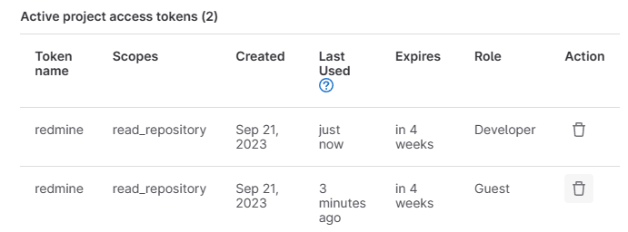
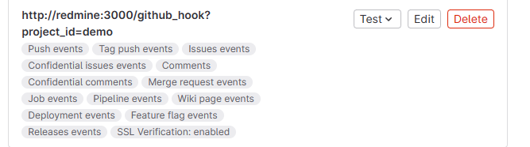

# 要件

- [ ] Redmine 上で、Git リポジトリの差分を確認できる
  - `redmine:4.1.1` ならどのプラグインも動いた
- [x] GitLab 上で、コミットメッセージに記載の ID が Redmine へリンクされる

# 方法

## 0. 初期構築

以下は、構築した Redmine でチケット作成を可能にするための、初期構築手順

### プラグインのインストール

```
cd redmine/plugins/
git clone https://github.com/alphanodes/redmine_messenger.git
```

### 選択肢の値 > チケットの優先度

- 「新しい値」から、適当に「test-priority」というチケットの優先度を作成

### チケットのステータス

- 「新しいステータス」から、適当に「test-status」というステータスを作成

### トラッカー

- 「新しいトラッカー」から、適当に「test-tracker」というトラッカーを作成

### プロジェクト

- 「新しいプロジェクト」から、適当に「test-pj」というプロジェクトを作成

### リポジトリ

| バージョン管理システム | 識別子       | リポジトリのパス                 |
| ---------------------- | ------------ | -------------------------------- |
| Git                    | `local-repo` | `/usr/src/redmine/repo/demo.git` |

### Web Hooks

アクセストークンはDeveloperでないと使えなかった。
これをgit configのリモートリポジトリとして設定しておけば使える。


## 1. GitLab リポジトリの閲覧

基本的に、Redmine のローカルリポジトリが必要になる。
従って、論外だがマウントを共有する方法[^redmine-gitlab-mount]もある。

[^redmine-gitlab-mount]: [Redmine と Gitlab を連携する方法 | 3 月 | 2018 年 | Corporate Blog | 三栄ハイテックス株式会社・LSI 設計や人工知能、組み込みソフト、ビジネス IT 支援](https://www.sanei-hy.co.jp/blog/2018/03/00133/)

Redmine と GitLab を連携するプラグイン[^redmine-gitlab-plugin]があるらしい。
従来は、fetch して、Redmine のローカルリポジトリが必要だったが、これを解消可能になるらしい。
但し、これは自己署名証明書に対応していないので、これが使っているライブラリの作法[^NARKOZ-gitlab-ignore]に則って無効化する必要がある。
しかも、4.19 に対応していないので、自力で変更が必要。
こうすれば、Web Hooks 無しで、勝手に同期してくれる。(ローカルなものがあるかは不明)

```diff:ruby
## Set Gitlab endpoint and token
Gitlab.endpoint = root_url + '/api/v4'
Gitlab.private_token = password
+ Gitlab.httparty = {verify: false}
```

[^redmine-gitlab-plugin]: [Redmine と GitLab の連携プラグインを開発しました！ | フューチャー技術ブログ](https://future-architect.github.io/articles/20210908a/)
[^NARKOZ-gitlab-ignore]: https://github.com/NARKOZ/gitlab/commit/40295b8889c0094babffc81a5d7749d32b0fbda6

いきなりこれは難しそうだが、GitHub[^redmine_github_hook], [^redmine-github-webhooks] なら他にも需要がありそう。
これはきちんと Redmine のプラグインページ[^github-hook]にあった。

[^redmine_github_hook]: https://github.com/koppen/redmine_github_hook
[^redmine-github-webhooks]: [GitHubとRedmineの連携 －Webhooks編－ - DX事業 - マクニカ](https://www.macnica.co.jp/business/dx/manufacturers/github/blog_20190109.html)
[^github-hook]: [Github Hook - Plugins - Redmine](https://www.redmine.org/plugins/redmine_github_hook)

GitLab側のWeb Hooksに於いて、Push Evnetsでも発火するようにすれば通知してくれる。


尚、`参照用キーワード`で指定したキーワードをコミットメッセージに入れないと、チケットのページにコミットが紐づかない。

## 2. Redmine チケットへの連携

Issues を無効化して、統合の設定をしておけば、リンクが勝手に Redmine になる。
そんなに有用でもない。

## 3. Close 検知による連携

Close 検知で連携する方法[^redmine_github_hook-note]もあるらしい。

[^redmine_github_hook-note]: [GitHub と Redmine を連携させてチケット管理を楽にする方法 | OC テックノート](https://oc-technote.com/github/github-redmine/)

## デバッグ

- リポジトリの権限が、`redmine`で触れない場合

```
["  GithubHook: Executing command: 'git fetch origin 'refs/heads/master:refs/heads/master''","  GithubHook: Command 'git fetch origin 'refs/heads/master:refs/heads/master'' didn't exit properly. Full output: [\"error: cannot open FETCH_HEAD: Permission denied\\n\"]","  GithubHook: Redmine repository updated: git (Git: 2.9ms, Redmine: 1.7ms)"]
```

- リポジトリにアクセスできる権限が無い場合

```
["  GithubHook: Executing command: 'git fetch origin 'refs/heads/master:refs/heads/master''","  GithubHook: Command 'git fetch origin 'refs/heads/master:refs/heads/master'' didn't exit properly. Full output: [\"fatal: could not read Username for 'https://gitlab': No such device or address\\n\"]","  GithubHook: Redmine repository updated: git (Git: 132.1ms, Redmine: 2.1ms)"]
```

# その他

## Docker による構築

- https://qiita.com/hadacchi/items/ca10939ca016147e225a
